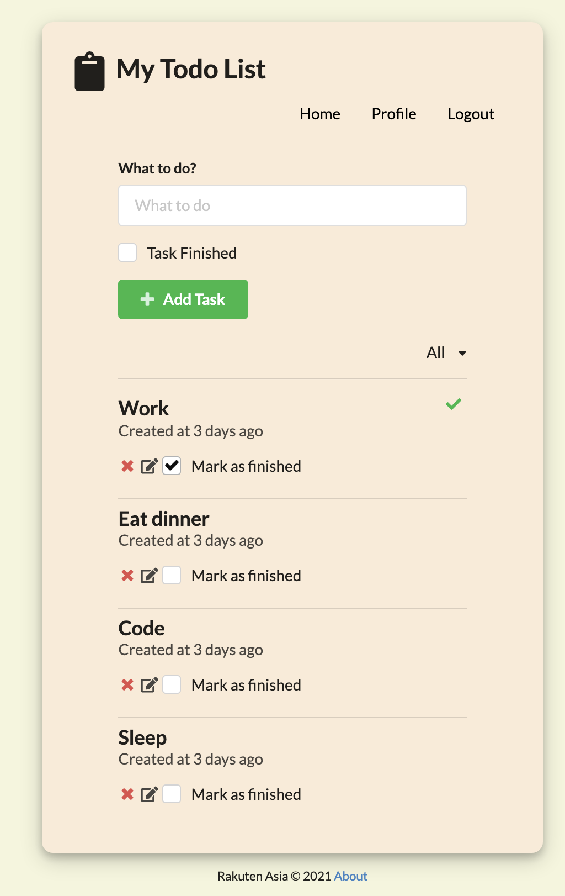

# REACT-TO-DO-LIST

## Back End Code (Spring Boot)

https://github.com/Jacob12138xieyuan/springboot-to-do-list

## Live Demo

https://react-to-do-list-rakuten.herokuapp.com/

## Start Dev

In the project directory, you can run:

### `npm start`

Runs the app in the development mode.\
Open [http://localhost:3000](http://localhost:3000) to view it in the browser.

The page will reload if you make edits.\
You will also see any lint errors in the console.
